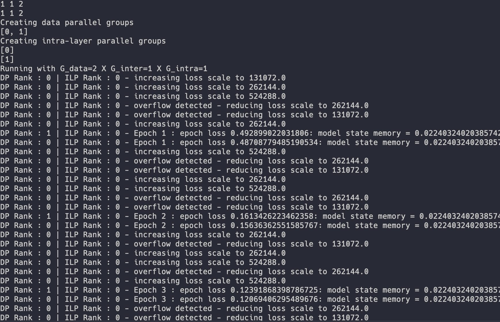

.. Copyright 2022 Parallel Software and Systems Group, University of Maryland.
   See the top-level LICENSE file for details.

   SPDX-License-Identifier: Apache-2.0 WITH LLVM-exception

***************
Getting Started
***************

Prerequisites
=============

AxoNN has the following minimum requirements, which must be installed before
AxoNN is run:

#. Python 2 (2.7) or 3 (3.5 - 3.10)
#. PyTorch
#. mpi4py

Installation
============

AxoNN is a python package. So if you're using a python environment (like venv or conda), it should be active prior to installation.
It should also have pytorch installed.

Install and Build AxoNN
-----------------------

You can install AxoNN from its GitHub repository using the following commands.

.. code-block:: console

  $ git clone https://github.com/hpcgroup/axonn.git
  $ cd axonn
  $ pip install -e .

Check Installation
------------------

You can check your installation with the example in axonn/tests/test_vit.py that trains a ViT on MNIST.

The example depends on the following packages. If you do not have them already, you can install them with the commands:

.. code-block:: console

  $ pip install einops
  $ pip install tqdm
  $ pip install pytest

You can download the dataset with the given command. Note that this requires an internet connection. This step only has to be done once.

.. code-block:: console

  $ python -c "import torchvision; torchvision.datasets.MNIST(root=\"./axonn/tests\", download=True, train=True)"

The next few commands can all be a part of a submit script for a job on an hpc cluster.

Set G_inter, G_data, and the memory optimization flag (0 -> disabled, 1 -> enabled)

.. code-block:: console

  $ export G_inter=1
  $ export G_data=2
  $ export memopt=0

To run the test, use the following command (which may differ for various systems).
This trains on 2 GPUs with 2x data parallelism.

.. code-block:: console

  $ mpirun -np 2 python axonn/tests/test_vit.py

If the test runs successfully, you should see output such as the following:

